# Busca PE — Guía de pruebas

> Rama `Jesus/BuscaPe`. Producto: **directorio de negocios** (buscar cerca → contactar). Sin custodia por defecto.

Modelo de monetización: **Suscripciones** (cliente premium / negocio Pro) + **publicidad** (AdSense + banners admin).
URL local: `http://localhost:8000/app`

### Cambios clave Busca PE

- **Anuncios** (antes “servicios”): API `GET /api/v1/listings/search`, panel `Mis anuncios`, vencen a los **5 días** (configurable en Admin → Configuración → Anuncios).
- **Contactos**: estados `nuevo` → `visto` → `cerrado`. Límites: cliente free **3 contactos/mes**, negocio free **2 contactos recibidos/mes**.
- **Ubicación**: GPS o selector departamento / provincia / distrito en búsqueda; sedes con lat/lng opcional.
- **Admin**: Reportes, Kardex, Publicidad (`/admin/reportes`, `/admin/kardex`, `/admin/publicidad`).
- **Cron en producción**: guía completa [`GUIA_CRON_CPANEL.md`](GUIA_CRON_CPANEL.md) · prueba rápida `public/_cron.php?token=...&task=all`

> Para la lista completa de cambios de la fase 2 (custodia + sedes + evidencia + historial),
> ver [`FASE2_CUSTODIA_SEDES.md`](./FASE2_CUSTODIA_SEDES.md).

---

## Credenciales

| Rol | Email | Contraseña | Plan inicial |
|---|---|---|---|
| **Admin** | `jesusalexander96@hotmail.com` | `12345678` | Admin |
| **Proveedor** | `proveedor@gmail.com` | `12345678` | Pro · Trial 30 días |
| **Cliente** | `usuario@gmail.com` | `12345678` | Free |

> Para resetear los 3:
> ```bash
> php artisan chamba:seed-test-users --password=12345678
> php artisan chamba:make-admin --email=jesusalexander96@hotmail.com --promote --password=12345678
> ```

---

## Resumen de planes

| Audiencia | Free | Pago |
|---|---|---|
| **Proveedor** | 3 contactos/mes · Sin badge · Final de resultados | **Pro S/ 29/mes** · Ilimitado · Badge "Pro" · Top de búsqueda · WhatsApp visible · 20 servicios |
| **Cliente** | Buscar y solicitar | **Premium S/ 9/mes** · Más contactos al mes · Sin publicidad en la app |

---

## 1. Home pública


- Hero con gradiente azul → cyan, CTA "Buscar".
- Servicios destacados: los **Pro aparecen primero** con badge naranja.
- Sección "¿Cómo funciona?" (buscar → revisar ficha con mapa/horario → contactar; bloque para negocios sin sedes).

---

## 2. Login

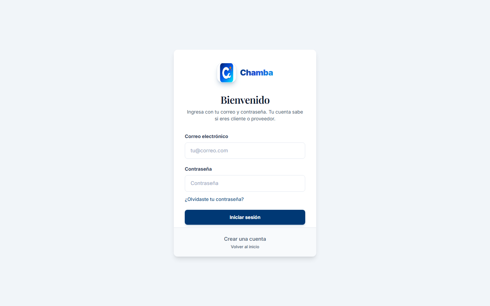

- Solo email + contraseña. **Sin selector de rol**: el backend redirige según rol real.
  - `cliente` → home
  - `proveedor` → `/app/proveedor/panel`
  - `admin` → `/app/admin`

---

## 3. Búsqueda con badge Pro

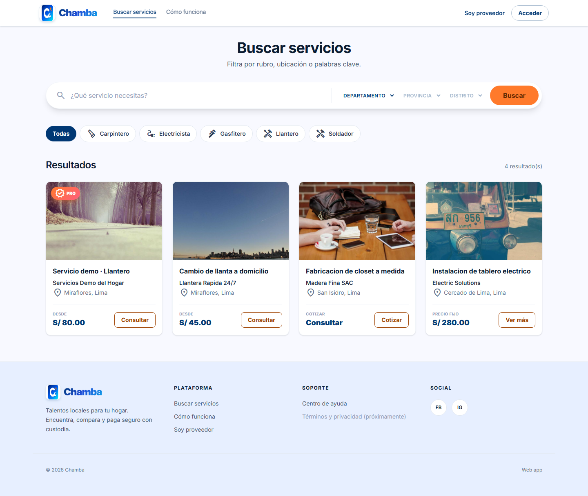

- Filtros por categoría y ubicación.
- El servicio del proveedor Pro lleva insignia **PRO** y va en primera posición.

---

## 4. Cliente · Home autenticado


- Header con avatar e identificador de rol "CLIENTE".
- Bottom nav (móvil) con "Inicio · Buscar · Solicitudes · Cuenta".

---

## 5. Cliente · Suscribirse a Premium

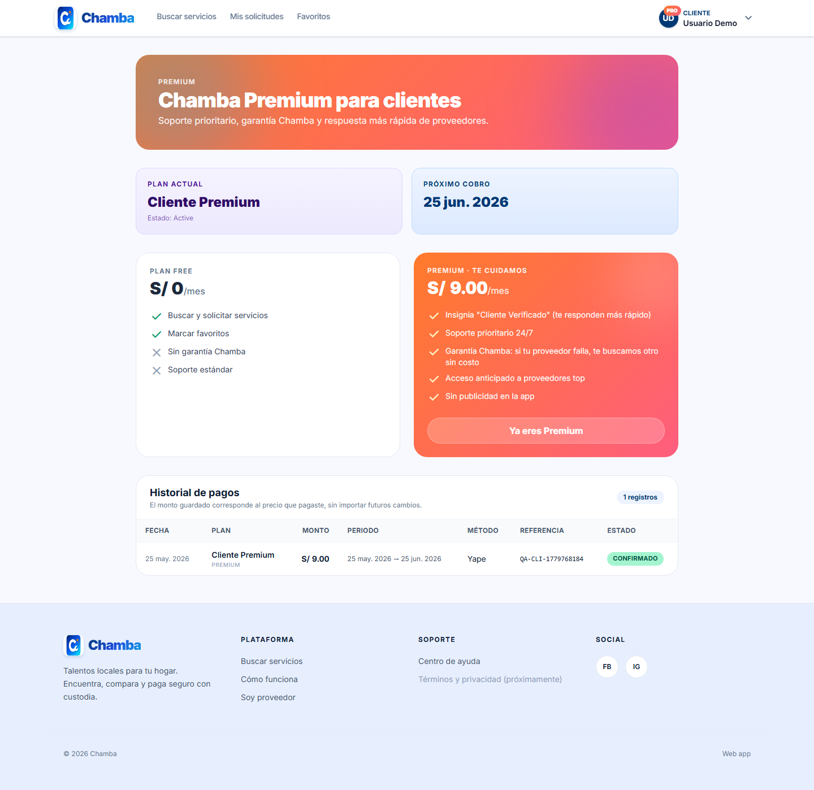

1. Click en **"Hacerme Premium"** → abre el formulario.
2. Yapea/transfiere el monto al **999999999** (configurable en `.env`).
3. Carga la referencia y envía.
4. El pago queda en `pendiente_revision` esperando al admin.

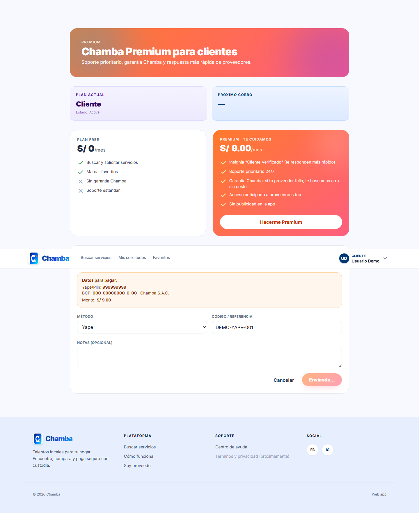

- Aparece confirmación: *"Pago registrado. Lo revisaremos y activaremos tu Premium en unas horas."*

---

## 6. Cliente · Mi cuenta

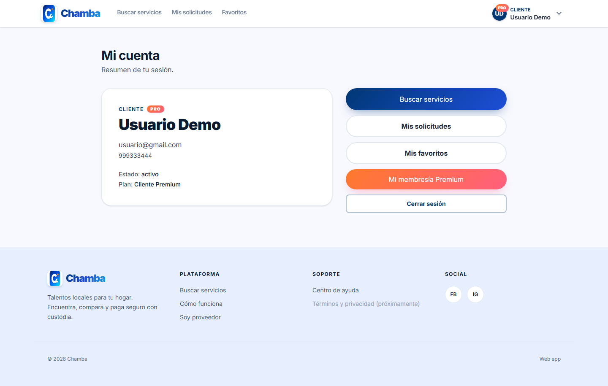

- Etiqueta del plan actual.
- CTAs por rol: Buscar, Mis solicitudes, Favoritos, Hazte Premium.

---

## 7. Proveedor · Panel con trial

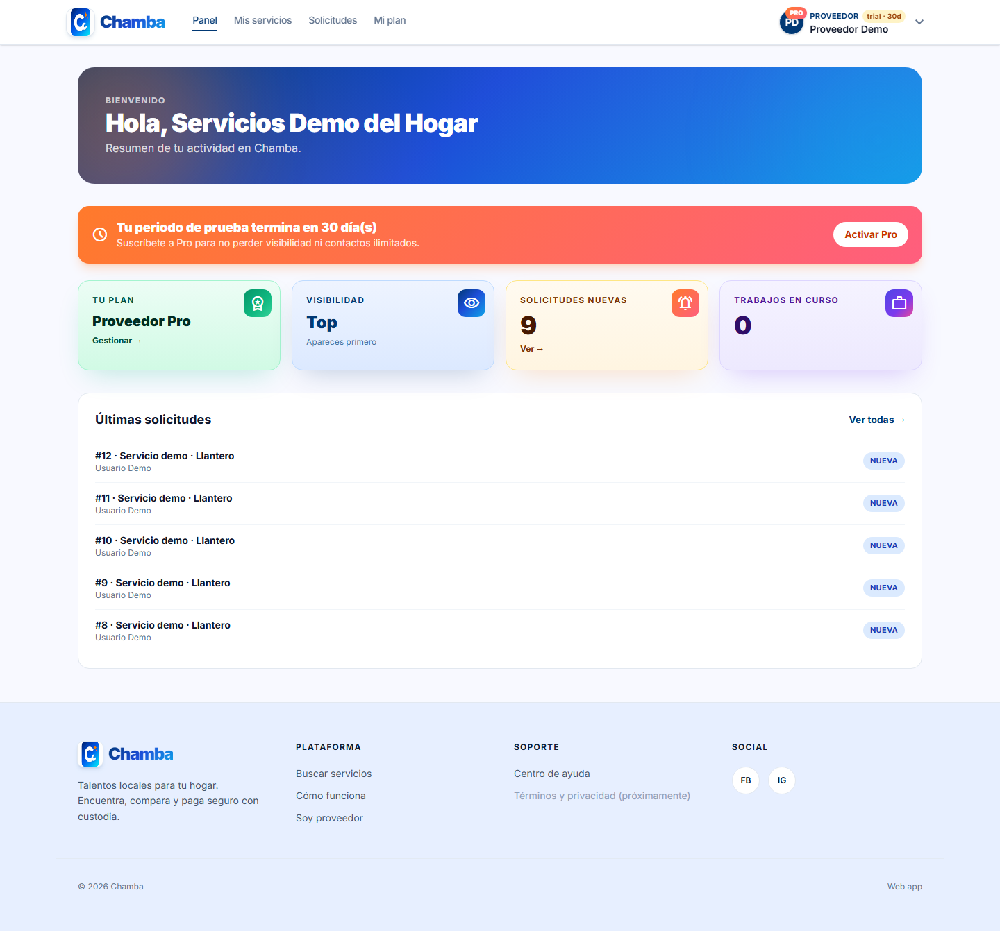

- Avatar con badge **PRO** + chip "trial · 30d".
- **Banner naranja**: "Tu periodo de prueba termina en N día(s)".
- KPIs: Tu plan · Visibilidad · Solicitudes nuevas · Trabajos en curso.
- Lista de últimas solicitudes recibidas.

---

## 8. Proveedor · Mi plan Pro

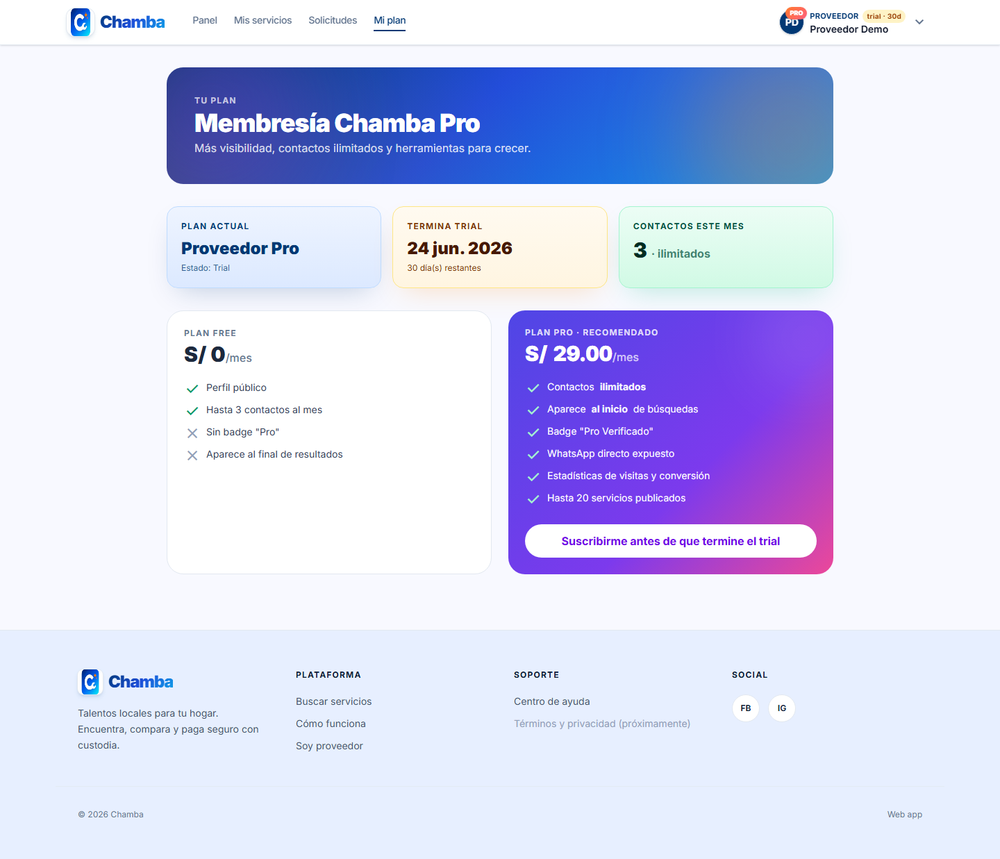

- Comparativa Free vs Pro.
- "Termina trial" con cuenta regresiva.
- Contactos del mes (3 / ilimitados según el plan).
- Botón **"Suscribirme antes de que termine el trial"**.

---

## 9. Proveedor · Solicitudes

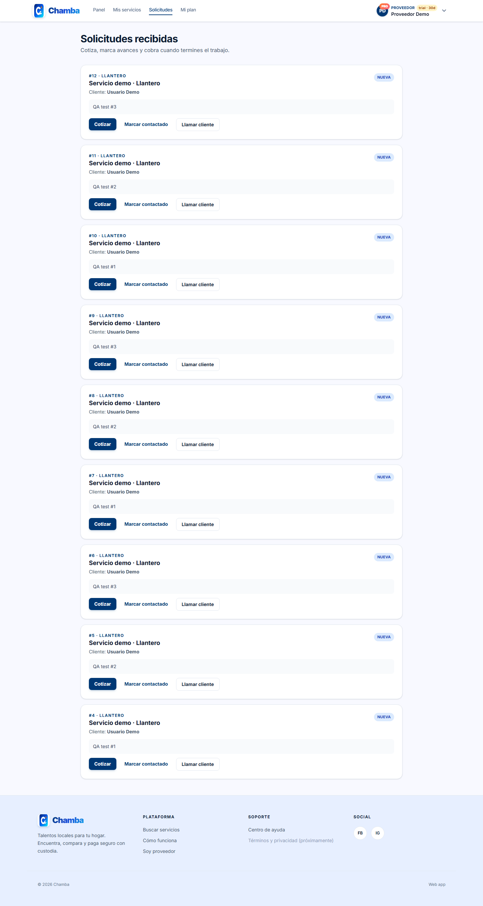

- Filtros por estado.
- Cada solicitud incluye nombre del cliente, mensaje y canal de contacto.

---

## 10. Admin · Panel general

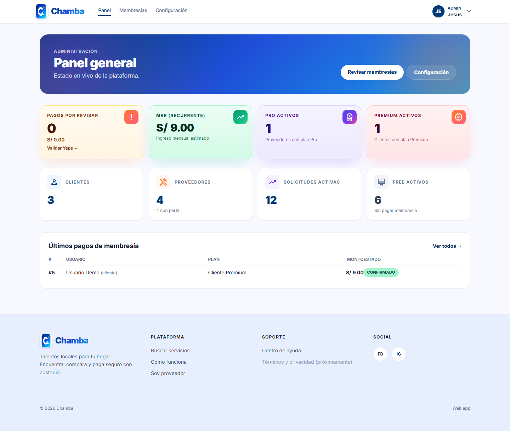

- KPIs del modelo membresía: **Pagos por revisar · MRR · Pro activos · Premium activos**.
- Métricas globales: Clientes, Proveedores, Solicitudes activas, Free activos.
- Tabla "Últimos pagos de membresía".

---

## 11. Admin · Membresías (validar Yape)

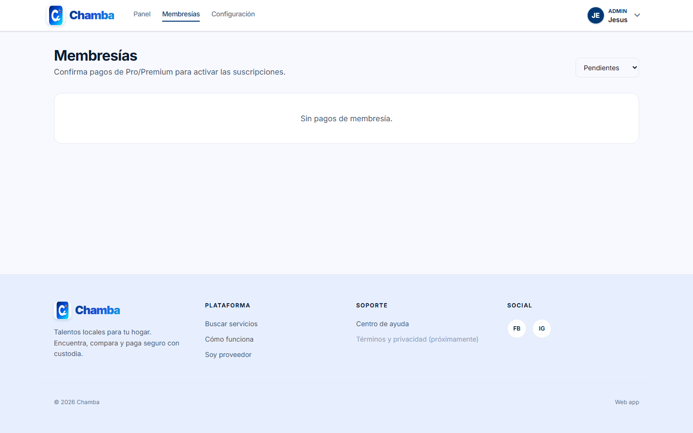

- Lista de pagos `pendiente_revision`.
- Botones **Activar** / **Rechazar** por fila.
- Al confirmar, la suscripción del usuario pasa a `active` con periodo de 1 mes.

---

## 12. Admin · Configuración (Planes y precios)

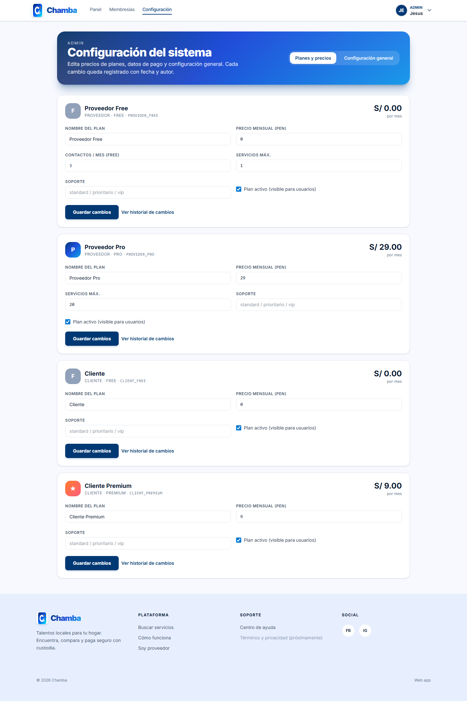

Toda la configuración del sistema vive en BD y es editable desde aquí. Cambios al instante, sin tocar `.env`.

- Tarjeta por plan: nombre, precio mensual, contactos/mes (Free), máx. servicios, soporte, activo/inactivo.
- Botón **"Guardar cambios"** registra automáticamente quién y cuándo realizó el cambio.
- Botón **"Ver historial de cambios"** muestra el diff de cada modificación (`old → new`).

> 💡 **¿Qué pasa si subo el precio de S/ 29 a S/ 35?**
> Los pagos antiguos (`subscription_payments.amount`) **no cambian**: cada pago guarda el monto que el usuario pagó en su momento. El nuevo precio aplica solo a los pagos futuros. El historial del proveedor es 100% fiel.

---

## 13. Admin · Configuración general

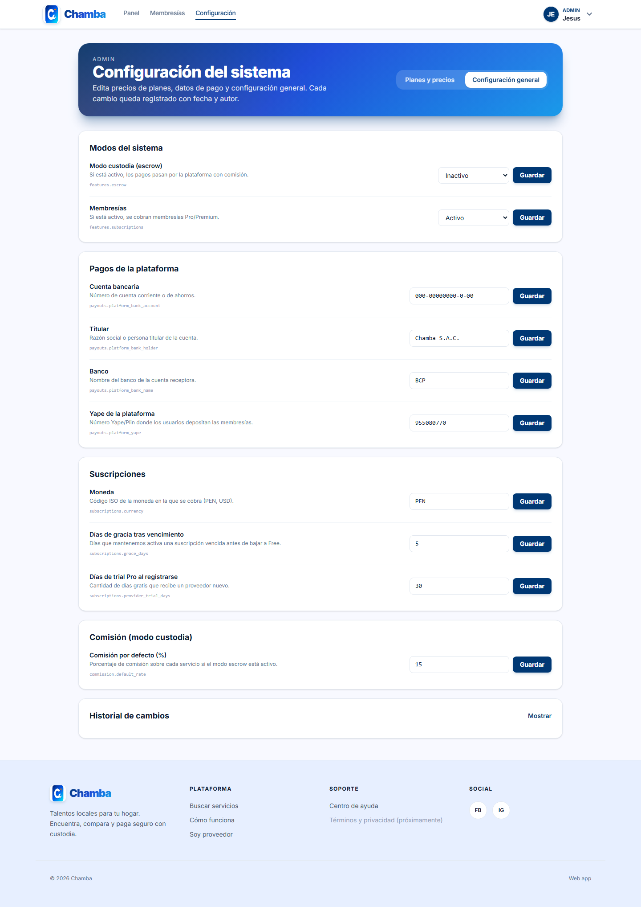

Todo lo que antes vivía en `.env`, ahora editable:

| Grupo | Setting | Ejemplo |
|---|---|---|
| **Modos del sistema** | `features.escrow` · `features.subscriptions` | Activar/desactivar custodia o membresías |
| **Pagos de la plataforma** | `payouts.platform_yape` · `payouts.platform_bank_*` | Cambiar Yape al que los usuarios depositan |
| **Suscripciones** | `subscriptions.provider_trial_days` · `subscriptions.grace_days` · `subscriptions.currency` | 30 días de trial, 5 de gracia |
| **Custodia (escrow)** | `commission.default_rate` | % de comisión global |

Cada cambio registra:
- Valor anterior → valor nuevo
- Usuario admin que lo realizó
- Fecha y hora exacta

Esto crea una **auditoría completa** del sistema (`system_settings_log`).

---

## 14. Admin · Cuenta

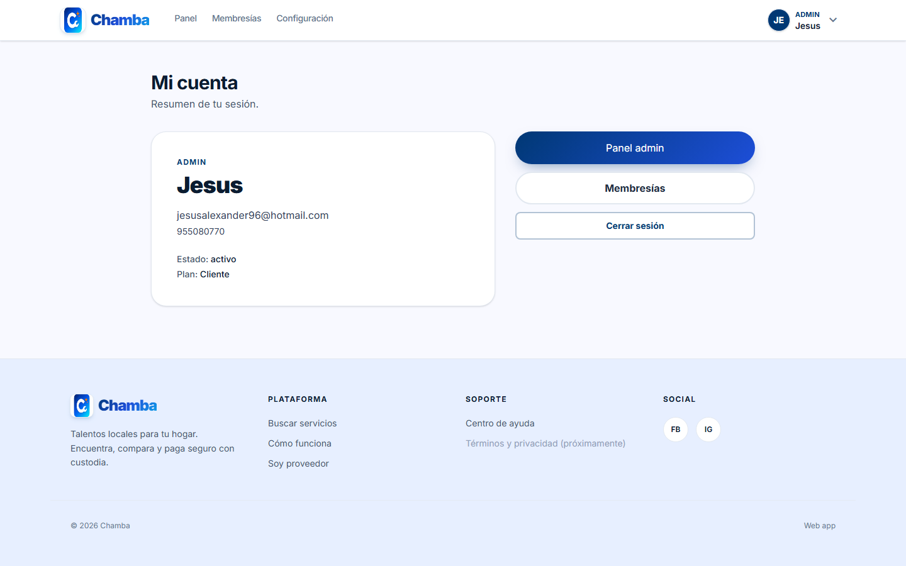

- Acceso rápido a Panel · Membresías · Configuración.
- Si `features.escrow=true`, también aparecen "Pagos en custodia" y "Retiros".

---

## Cómo se almacena la configuración

### Antes (problemático)
```
config/chamba.php (precios) → .env (precios) → reiniciar para que tomen efecto
```

### Ahora (gestionable)
```
Tabla `subscription_plans` (precios + features)        → editable desde admin
Tabla `system_settings`     (Yape, trial, gracia...)   → editable desde admin
Tablas `*_log`              (cada cambio queda firmado)
.env                        (solo fallback inicial al sembrar)
```

> Al guardar, el `SystemSettingsService` invalida el cache (`Cache::forget`) para que el cambio se vea inmediatamente sin reiniciar.

### Tablas nuevas

| Tabla | Para qué |
|---|---|
| `system_settings` | Configuración global key/value (Yape, trial days, grace days, currency, commission, feature flags) |
| `system_settings_log` | Auditoría de cambios en `system_settings` (quién, cuándo, valor previo → nuevo) |
| `subscription_plans_log` | Auditoría de cambios en planes (precio, features, nombre, activo) |

---

## Almacenamiento de archivos (FTP) y validación

Toda imagen subida por la app (avatars, comprobantes Yape/Plin, fotos de servicios) se guarda en un **FTP externo** definido en `.env` (`CHAMBA_FTP_*`). Estructura en el servidor:

```
/avatars/    → fotos de perfil (cliente, proveedor, admin)
/services/   → fotos de servicios (galería del proveedor)
/payments/   → comprobantes de pago de membresía (privados, solo dueño + admin)
```

### Pipeline de validación (defensa en profundidad)

Toda imagen pasa por `MediaStorageService` antes de subirse:

1. **Tamaño** ≤ 5 MB (configurable en `CHAMBA_MEDIA_MAX_KB`).
2. **MIME real** detectado con `finfo` (no se confía en el header del cliente).
3. **Magic bytes** verificados (`FF D8 FF` para JPEG, `89 50 4E 47` para PNG, `RIFF…WEBP` para WEBP).
4. **Re-encodificación con GD**: la imagen se decodifica y vuelve a generarse desde cero. Cualquier payload incrustado (`<?php ?>` en EXIF, polyglots, scripts en metadata, etc.) se pierde.
5. **Downscale automático** a 800px (avatar), 1600px (comprobante / servicio).
6. **Nombre aleatorio** (UUID). El nombre original del cliente se descarta para evitar path traversal.

> No reemplaza un antivirus tipo ClamAV, pero cubre el 99% de los casos típicos: imágenes con código embebido, EXIF malicioso, archivos con extensión falsa, polyglots PHP/JPEG.

### Endpoint proxy

Las imágenes se sirven a través de `/api/v1/media/{folder}/{name}`:

- `avatars/*` y `services/*` → **públicos**, cache `public, max-age=3600`.
- `payments/*` → **privados**, requieren `auth:sanctum` y solo accesibles para el dueño del pago o un admin.

Si publicas el FTP por HTTP en el futuro, basta con setear `CHAMBA_FTP_PUBLIC_URL` y todas las URLs se servirán directo sin pasar por Laravel.

### Variables `.env` necesarias

```env
CHAMBA_FTP_HOST=jaapsystem.com
CHAMBA_FTP_USERNAME=ftp_chamba@jaapsystem.com
CHAMBA_FTP_PASSWORD="@nt0nP4ch4505"
CHAMBA_FTP_PORT=21
CHAMBA_FTP_PASSIVE=true
CHAMBA_FTP_SSL=false
CHAMBA_FTP_TIMEOUT=20
CHAMBA_FTP_ROOT=/
CHAMBA_FTP_PUBLIC_URL=        # opcional: si el FTP tiene URL pública HTTP
CHAMBA_MEDIA_MAX_KB=5120
```

Extensiones PHP requeridas en el servidor: `gd`, `ftp`, `fileinfo`, `exif`.

### Tablas nuevas / cambios

| Tabla | Cambio |
|---|---|
| `users` | + `avatar_path VARCHAR(255) NULL` |
| `subscription_payments` | + `proof_image_path VARCHAR(255) NULL` |
| `service_payments` | + `proof_image_path VARCHAR(255) NULL` |
| `service_images` | tabla normalizada: `id, provider_service_id, path, sort_order, created_at, updated_at` |

---

## QA automatizado

Comando que valida **40 escenarios end-to-end** (login de cada rol, planes, pagos, confirmación admin, **límite Free de 3 contactos/mes**, búsqueda ordenada por Pro, KPIs admin, edición dinámica de settings y planes con auditoría, snapshot histórico de pagos, **subida real al FTP de avatar/comprobante/imagen de servicio + bloqueo de archivos no-imagen**):

```bash
php artisan chamba:qa-smoke
# → Resumen: 40/40 checks OK
```

Para regenerar las capturas de esta guía:

```bash
node webapi/scripts/qa-screenshots.mjs
# → 14 PNGs en docs/screenshots/
```

---

## Comandos útiles

| Comando | Uso |
|---|---|
| `php artisan chamba:seed-test-users [--password=12345678]` | Crea/actualiza proveedor y cliente demo |
| `php artisan chamba:make-admin --list` | Lista todos los usuarios |
| `php artisan chamba:make-admin --email=... --promote --password=...` | Promueve a admin (y resetea contraseña) |
| `php artisan chamba:qa-smoke` | Smoke test completo del API (33 checks) |
| `php artisan chamba:expire-subscriptions` | Caduca trials/suscripciones vencidas (cron diario) |
| `php artisan cache:clear` | Limpia cache de settings (también se limpia automáticamente al guardar) |

---

## REST endpoints clave

### Públicos
| Método | Ruta | Descripción |
|---|---|---|
| GET | `/api/v1/subscriptions/plans` | Catálogo de planes + datos de pago de la plataforma |
| GET | `/api/v1/services/search` | Buscar servicios (Pro va primero) |

### Usuario autenticado
| Método | Ruta | Descripción |
|---|---|---|
| GET | `/api/v1/subscriptions/me` | Mi suscripción + pagos enriquecidos (plan, periodo, monto histórico, URL del comprobante) |
| POST | `/api/v1/subscriptions/pay` | Registrar pago de membresía. Acepta `proof` (multipart) con la captura del Yape/Plin |
| POST | `/api/v1/subscriptions/cancel` | Cancelar auto-renovación |
| POST | `/api/v1/me/avatar` | Subir/cambiar foto de perfil (multipart `avatar`) |
| DELETE | `/api/v1/me/avatar` | Quitar foto de perfil |
| POST | `/api/v1/provider/services/{id}/images` | Agregar foto a un servicio (multipart `image`) |
| DELETE | `/api/v1/provider/services/{id}/images/{img}` | Eliminar foto del servicio |
| GET | `/api/v1/media/{folder}/{name}` | Proxy: avatars/services públicos, payments solo dueño/admin |

### Admin
| Método | Ruta | Descripción |
|---|---|---|
| GET | `/api/v1/admin/settings` | Listar todas las configuraciones |
| PUT | `/api/v1/admin/settings/{key}` | Actualizar un setting (registra log) |
| GET | `/api/v1/admin/settings-logs?key=...` | Historial de cambios |
| GET | `/api/v1/admin/plans` | Listar planes editables |
| PUT | `/api/v1/admin/plans/{id}` | Actualizar precio/features (registra log) |
| GET | `/api/v1/admin/plans/{id}/logs` | Historial de cambios del plan |
| GET | `/api/v1/admin/subscriptions/payments` | Pagos de membresía pendientes |
| POST | `/api/v1/admin/subscriptions/payments/{id}/confirm` | Activar membresía |

---

## Feature flags (modos del sistema)

Se controlan desde **Admin · Configuración general** (también vía `.env` como fallback inicial):

| Setting | `.env` (fallback) | Efecto |
|---|---|---|
| `features.escrow` | `CHAMBA_FEATURE_ESCROW` | Activa custodia/wallet/retiros |
| `features.subscriptions` | `CHAMBA_FEATURE_SUBSCRIPTIONS` | Activa membresías Pro/Premium |

> Las tablas escrow (`service_quotes`, `service_payments`, `provider_wallets`, `wallet_withdrawals`) siguen existiendo en BD. Para reactivar el modo custodia: pon `features.escrow` en **Activo** desde el panel admin.
